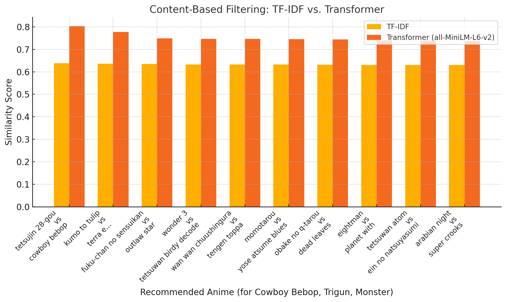
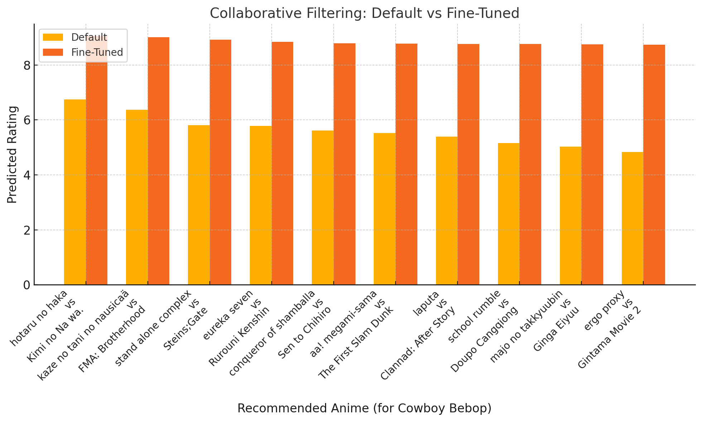
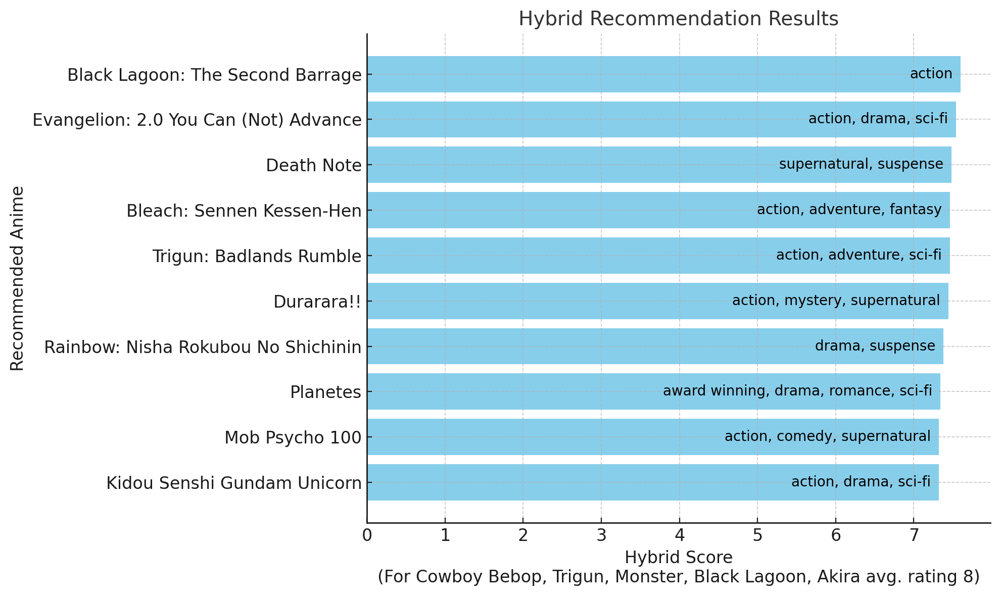
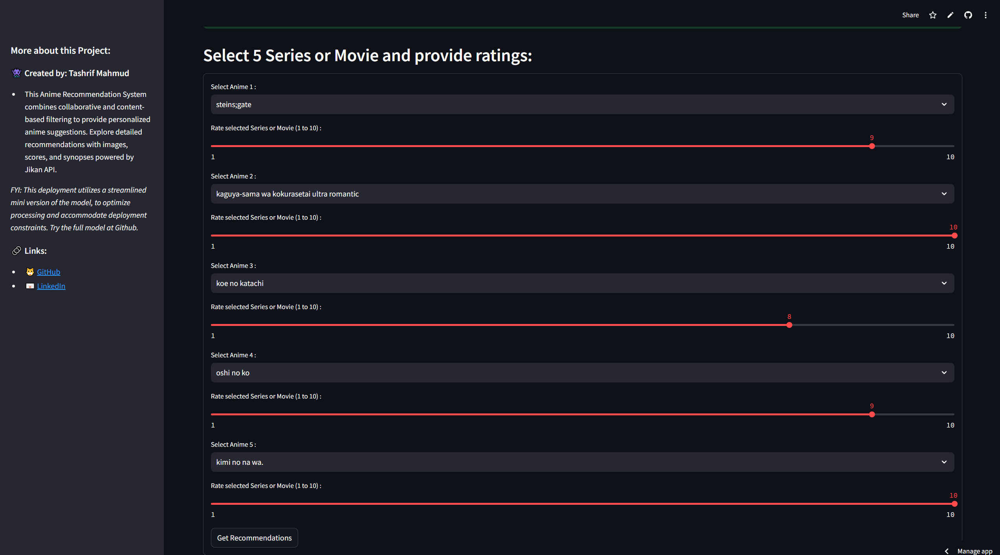
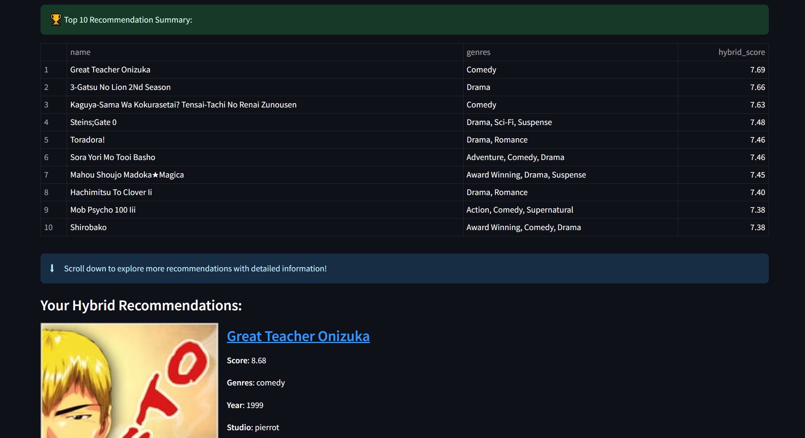

# Hybrid Recommender System  
> Tashrif Mahmud | :bar_chart: [Streamlit App](https://hybrid-recommender-system.streamlit.app) | :film_strip: [YouTube Video](https://www.youtube.com/watch?v=VUjMEUpg5ec)  

  

> **Tech Stack:** Python | Pandas | Matplotlib | Scikit-Learn | Surprise | NLP (Sentence Transformers) | API (Jikan API) | Streamlit | Kaggle  

## Project Overview  
We developed a robust recommendation system tailored for anime enthusiasts by combining collaborative and content-based filtering techniques. This system provides personalized recommendations enriched by the Jikan API, offering detailed information like images, synopses, and hybrid scoring to create a seamless user experience.  

---

## Dataset  
The primary dataset used for this project is the [MyAnimeList](https://www.kaggle.com/datasets/dsfelix/animes-dataset-2023) dataset, which is one of the most recent and comprehensive sources available. While we explored other Kaggle datasets, this dataset was chosen for its recency and depth, ensuring optimal results.  

---

## Dataset Preprocessing  
We undertook extensive preprocessing to prepare the data for model training. The steps are detailed in the following notebooks:  
- [1_data_cleaning_part_1](https://github.com/tashrifmahmud/Hybrid-Recommender-System/blob/main/1_data_cleaning_part_1.ipynb) (Content-Based Filtering)  
- [2_data_cleaning_part_2](https://github.com/tashrifmahmud/Hybrid-Recommender-System/blob/main/2_data_cleaning_part_2.ipynb) (Collaborative Filtering)  

### Preprocessing Steps:  
1. **Data Cleaning:**  
   - Removed missing, null, and duplicate values.  
   - Filtered out placeholder titles, 'unknown' details, and NSFW entries.  
2. **Data Transformation:**  
   - Extracted the `year` of anime from the `aired` column.  
   - Simplified the `rating` column for easier textual relevance.  
3. **Column Reduction:**  
   - Dropped metadata columns irrelevant to the model's performance.  
4. **Sparsity Management:**  
   - Balanced the sparsity of titles and review counts to better simulate real-world data.  

For the content-based model, additional text preprocessing included:  
- Cleaning text by removing punctuation, newline characters, and spaces while converting to lowercase.  
- Tokenizing words using NLTK.  
- Removing stop words using NLTK's English corpus.  

---

## Content-Based Filtering  

### Model 1: TF-IDF Vectorization  
Our initial approach used a TF-IDF Vectorizer to create embeddings for textual data. We scaled numerical features like `year` using a standard scaler and combined them with the text embeddings using `hstack`. Cosine similarity was then applied to generate recommendations.  

While this approach demonstrated feasibility, the results were suboptimal. Detailed steps are available in [3_content_based_filtering_tfidf](https://github.com/tashrifmahmud/Hybrid-Recommender-System/blob/main/3_content_based_filtering_tfidf.ipynb).  

### Model 2: Sentence Transformers  
We switched to a pre-trained [Sentence Transformer](https://huggingface.co/sentence-transformers/all-MiniLM-L6-v2) to generate dense embeddings for the `combined_text` column. The `year` feature was scaled using Min-Max scaling and combined with the embeddings. Cosine similarity was computed for final recommendations. This approach significantly improved performance, as shown in [4_content_based_filtering_st](https://github.com/tashrifmahmud/Hybrid-Recommender-System/blob/main/4_content_based_filtering_st.ipynb).  

#### Comparison: TF-IDF vs. Sentence Transformers  
  

---

## Collaborative Filtering  

We implemented Singular Value Decomposition (SVD) to factorize the user-anime interaction matrix into latent factors. This method efficiently captures user preferences and anime features. Details are provided in [5_collaborative_filtering](https://github.com/tashrifmahmud/Hybrid-Recommender-System/blob/main/5_collaborative_filtering.ipynb).  

### Hyperparameter Tuning  
Using GridSearchCV, we fine-tuned the following parameters:  
- **Latent Factors:** 200 (to avoid overfitting).  
- **Epochs:** 20  
- **Learning Rate:** 0.005  
- **Regularization:** 0.05  

This tuning resulted in:  
- Training RMSE: 1.12  
- Test RMSE: 1.11  

  

---

## Hybrid Recommendation Model  

We combined content-based and collaborative filtering models using the following enhancements:  

- **Hybrid Weighting:**  
  - Content: 60%, Collaborative: 40%.  
  - Adjusted based on experimentation for balanced recommendations.  
- **Diversity Mechanism:**  
  - Limited similar titles (e.g., sequels) to a maximum of two per recommendation.  
- **Popularity Boost:**  
  - Introduced a 10% weight for popularity to highlight trending titles.  

  

---

## App Deployment  

A streamlined version of the hybrid model is deployed using [Streamlit](https://hybrid-recommender-system.streamlit.app/). Users can:  
1. Select and rate 5 anime.  
2. View a summary of the top 10 recommendations.  
3. Explore detailed recommendations (up to 40 titles) enhanced by Jikan API.  

### Jikan API Integration  
The [Jikan API](https://jikan.moe/) fetches essential details such as titles, images, synopses, and links to MyAnimeList pages, providing a polished user experience.  

---

## Links  
:bar_chart: [Streamlit App](https://hybrid-recommender-system.streamlit.app) | :film_strip: [YouTube Video](https://www.youtube.com/watch?v=VUjMEUpg5ec)  